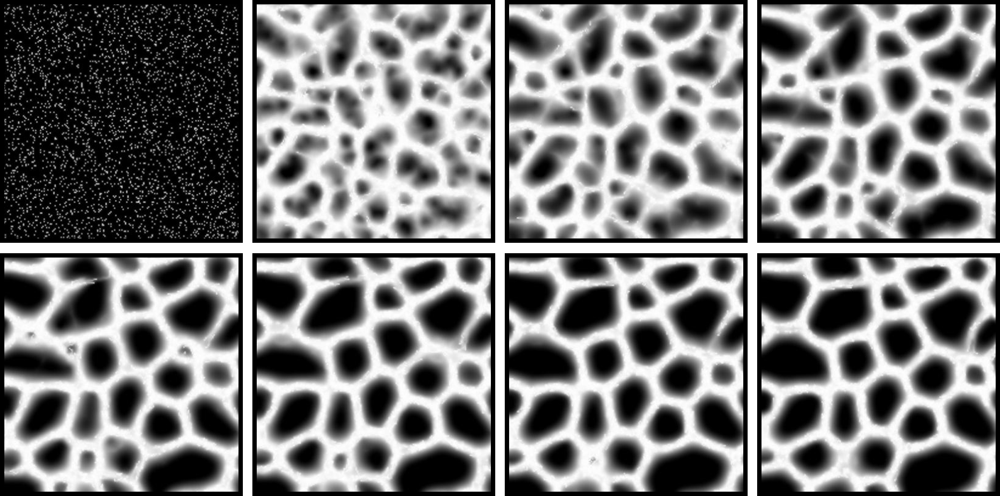

# Physarum-Simulations

*Physarum polycephalum* pattern-forming algorithm implementations in JS and Unity.

## Implementations
- `./unity`: Unity implementation using C# and compute shaders.
- `./js`: Initial prototype JavaScript implementation using p5.

## Images

  
  

  
  

## References
- [Original algorithm article (Jeff Jones, 2010)](https://direct.mit.edu/artl/article/16/2/127/2650/Characteristics-of-Pattern-Formation-and-Evolution)
- [GPU-powered *Physarum* simulation blog bost (Sage Jenson, 2019)](https://cargocollective.com/sagejenson/physarum)
- [Slime mould simulations in Unity (Sebastian Lague, 2021)](https://www.youtube.com/watch?v=X-iSQQgOd1A)
- [*Physarum* artwork using p5.js (Julien Verneuil, 2021)](https://www.onirom.fr/slime.html)
- [PCG hash](https://www.pcg-random.org/index.html)
- [Nakagaki, T., Kobayashi, R., Nishiura, Y. & Ueda, T. Obtaining multiple separate food sources: behavioural intelligence in the Physarum plasmodium.](https://pmc.ncbi.nlm.nih.gov/articles/PMC1691859/)
- [Shirakawa, T. & Gunji, Y.-P. Computation of Voronoi diagram and collisionfree path using the plasmodium of Physarum polycephalum](https://www.researchgate.net/publication/220475098_Computation_of_Voronoi_Diagram_and_Collision-free_Path_using_the_Plasmodium_of_Physarum_polycephalum)

